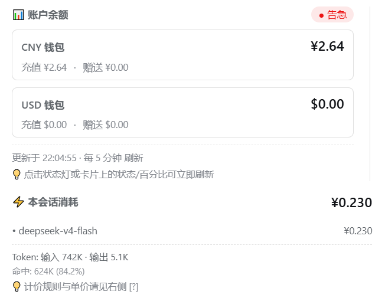
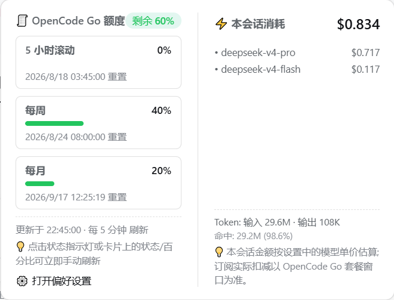
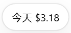
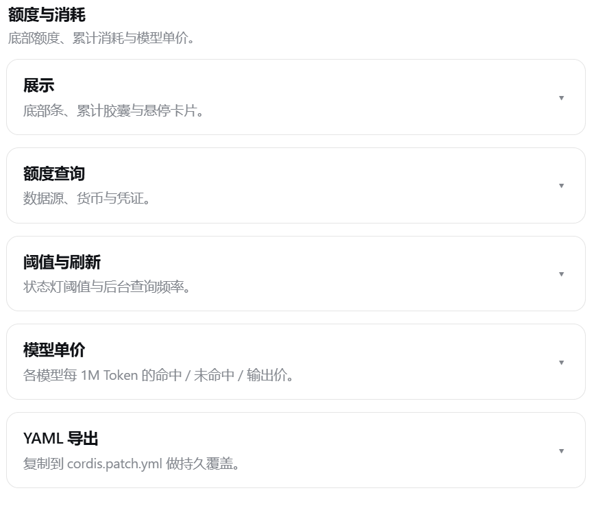
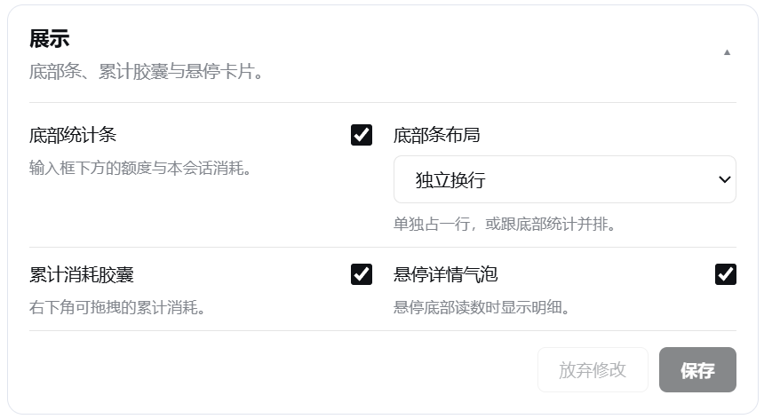
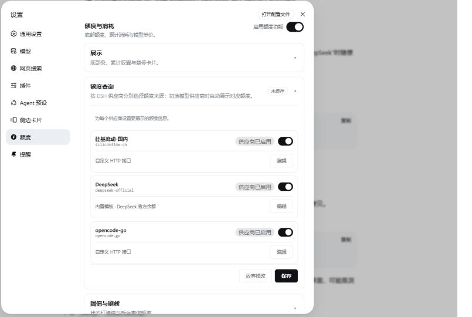
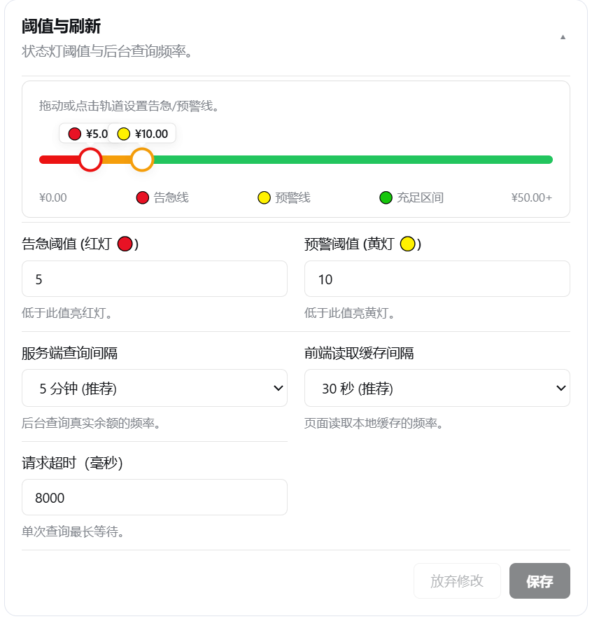

# dsh-credits

DeepSeek Harness（`dsh web`）额度插件：在输入框下方显示账户额度与本会话估算消耗；右下角另有可拖动的累计消耗胶囊。设置在侧栏「额度」（最后一项，货币硬币图标），分成多张可折叠卡片。

> 兼容性：`dsh-credits 0.2.4` 已适配 `dsh 0.1.1-rc.1`（即 0.1.1-rc1）的新版会话投影接口；TPS 与本会话金额可正常传递到 Web 前端，同时保留对旧版投影接口的兼容。

- **账户额度 + 状态灯**  
  DeepSeek 模式如 `🟢 余额 ¥97.69`；OpenCode Go 模式如 `🟢 Go 额度 月 6% · 周 12% · 5h 9%`。点击圆点可立即强刷。
- **跟随当前对话模型**  
  底部读数跟输入框选中的模型供应商走：只有 `opencode-go` 显示订阅用量，DeepSeek 官方以及其他供应商都显示官方余额。也可改成「自定义固定展示」，不随模型切换。
- **底部条布局**  
  默认独立换行，额度单独占底下一行；也可改成跟底部已有统计共用一行、排在最后。底部条、累计胶囊、悬停卡片都可以关掉。
- **本会话估算消耗**  
  按模型单价估算（单价可在设置里改）。DeepSeek V4 自 2026-08-17 起按北京时间自动套用峰谷价。
- **实时生成吞吐 TPS**
  直接消费 DSH 会话事件，在流式输出时估算并显示 `TPS n tok/s`；收到 provider 精确 usage 后自动替换估算值。可在「设置 → 展示 → 实时 TPS」关闭，不需要额外安装 `@linxin666/dsh-live-stats`。
- **累计消耗胶囊**  
  右下角可拖动气泡，查看今天 / 昨天 / 本周 / 本月 / 自定义时间范围内的跨会话估算总额（按当前计价货币与单价现算）。
- **设置卡片**  
  展示、额度查询、阈值与刷新、模型单价、YAML 导出各一张卡。每张独立「放弃修改 / 保存」，改过的字段可「恢复默认」。关掉再打开，未保存的草稿还在。
  顶部「启用额度功能」总开关关闭后会隐藏额度、TPS、峰谷徽章、悬停详情与累计消耗，停止额度轮询，并锁定展示、额度查询、阈值与刷新；模型单价和 YAML 导出仍可用。

## 界面预览

悬停底部读数会展开详情：DeepSeek 列出全部币种钱包，Go 列出三个用量窗口，下面是本会话估算。



底部额度默认独立占一行：


OpenCode Go 模式下，卡片改成三个窗口的用量百分比与重置时间：



右下角可拖动的累计消耗胶囊，按今天 / 昨天 / 本周 / 本月 / 自定义区间汇总跨会话估算：



设置 → 额度：多张可折叠卡片，同一功能区两列排布，每张卡单独保存。









## 数据源

| provider | 说明 | 上游接口 | 密钥 |
| :--- | :--- | :--- | :--- |
| `deepseek` | DeepSeek 官方余额 | `GET /user/balance` | `DEEPSEEK_API_KEY` |
| `opencode-go` | OpenCode Go 订阅用量 | `GET https://opencode.ai/zen/go/v1/usage` | `OPENCODE_GO_API_KEY` 或 OpenCode `auth.json` |

服务端会**同时缓存**官方余额和 Go 用量；切模型时底部直接换展示，不必再等一轮查询。

| 当前对话模型的供应商 | 底部展示 |
| :--- | :--- |
| `opencode-go` | OpenCode Go 订阅用量（5 小时 / 周 / 月） |
| `deepseek` | DeepSeek 官方余额 |
| 其他（Anthropic、OpenAI、OpenCode Zen 等） | DeepSeek 官方余额（默认） |

配置项 `provider`（以及设置里的「额度数据源」）只在还认不出当前模型时作为回退，**不会覆盖**已经识别到的模型供应商。默认回退是 `deepseek`。

OpenCode Go 密钥解析顺序：`opencodeApiKey` → `OPENCODE_GO_API_KEY`（credentials / 环境变量）→ `~/.local/share/opencode/auth.json`。

## 安装

```sh
dsh plugin --profile web add dsh-credits
```

装完后**重启 `dsh web`**。本地开发可改为：

```sh
dsh plugin --profile web add <本目录绝对路径>
```

升级：

```sh
dsh plugin --profile web remove dsh-credits
pnpm store prune
dsh plugin --profile web add dsh-credits@latest
```

卸载：

```sh
dsh plugin --profile web remove dsh-credits
```

## 从 dsh-balance 迁移

`dsh-credits` 已覆盖旧插件的全部能力（官方余额、本会话估算、设置面板），并加上 Go 订阅用量、累计胶囊、跟随当前模型。装上本包并确认底部只有一条额度读数后：

```sh
dsh plugin --profile web remove dsh-balance
```

然后删掉 profile 里的本地目录（常见是 `$DSH_HOME/profiles/web/dsh-balance-local`）以及 `cordis.patch.yml` 里给 `dsh-balance` 写的 `disabled: true`。源码仓库（例如 `dsh-balance`）也可以删，不再被引用。

## 配置

覆盖文件：`$DSH_HOME/profiles/web/cordis.patch.yml`。也可在设置 → 额度 改完后按卡片点「保存」。

常用展示项：

| 配置 | 默认 | 说明 |
| :--- | :--- | :--- |
| `quotaMode` | `follow` | `follow` 跟随当前对话模型；`custom` 固定用下面的 `provider` |
| `showDock` | `true` | 是否显示底部额度读数 |
| `dockLayout` | `own` | `own` 独立换行；`shared` 与底部已有统计共用一行 |
| `showCapsule` | `true` | 右下角累计消耗胶囊 |
| `showPopover` | `true` | 悬停底部读数时的双栏详情 |
| `showTps` | `true` | 是否显示实时 TPS |
| `enabled` | `true` | 额度功能总开关；关闭后隐藏相关 UI、停止轮询，并锁定展示、额度查询、阈值与刷新；不影响模型单价和 YAML 导出 |

### OpenCode Go 回退

```yaml
- id: dsh-credits
  config:
    quotaMode: follow
    showDock: true
    dockLayout: own
    showCapsule: true
    showPopover: true
    provider: opencode-go
    opencodeApiKeyRef: OPENCODE_GO_API_KEY
    opencodeBaseUrl: https://opencode.ai/zen/go/v1/usage
    warningThreshold: 10          # 无法识别模型时的默认回退; 选了 Go 模型会改看剩余额度 %
    dangerThreshold: 5            # 剩余额度 < 5% 红灯
    refreshIntervalMs: 300000
    clientPollIntervalMs: 30000
    timeoutMs: 15000
    currency: USD
```

这段 `provider: opencode-go` 只决定「还没选模型 / 识别失败」时先看哪一套。真正切到 Go 模型后才会用三个窗口的用量百分比与重置时间；状态灯按「剩余最少」的窗口判定。套餐没有固定美元上限可展示。

### DeepSeek 人民币账户

```yaml
- id: dsh-credits
  config:
    provider: deepseek
    apiKeyRef: DEEPSEEK_API_KEY
    baseUrl: https://api.deepseek.com
    warningThreshold: 10
    dangerThreshold: 5
    refreshIntervalMs: 300000
    clientPollIntervalMs: 30000
    timeoutMs: 8000
    currency: CNY
    prices:
      deepseek-v4-flash:
        cacheHit: 0.1
        cacheMiss: 3
        output: 9
        peak: { cacheHit: 0.1, cacheMiss: 3, output: 9 }
        offPeak: { cacheHit: 0.05, cacheMiss: 1.5, output: 4.5 }
      deepseek-v4-pro:
        cacheHit: 0.3
        cacheMiss: 9
        output: 27
        peak: { cacheHit: 0.3, cacheMiss: 9, output: 27 }
        offPeak: { cacheHit: 0.15, cacheMiss: 4.5, output: 13.5 }
      deepseek-chat: { cacheHit: 0.1, cacheMiss: 1, output: 2 }
      deepseek-reasoner: { cacheHit: 1, cacheMiss: 4, output: 16 }
```

### DeepSeek 美元账户

```yaml
- id: dsh-credits
  config:
    provider: deepseek
    apiKeyRef: DEEPSEEK_API_KEY
    baseUrl: https://api.deepseek.com
    warningThreshold: 2.0
    dangerThreshold: 0.5
    currency: USD
    prices:
      deepseek-v4-flash:
        cacheHit: 0.014
        cacheMiss: 0.42
        output: 1.26
        peak: { cacheHit: 0.014, cacheMiss: 0.42, output: 1.26 }
        offPeak: { cacheHit: 0.007, cacheMiss: 0.21, output: 0.63 }
      deepseek-v4-pro:
        cacheHit: 0.042
        cacheMiss: 1.26
        output: 3.78
        peak: { cacheHit: 0.042, cacheMiss: 1.26, output: 3.78 }
        offPeak: { cacheHit: 0.021, cacheMiss: 0.63, output: 1.89 }
```

`prices` 是「当前 `currency` 下每 1M token」的单价。V4 可写 `peak` / `offPeak`（高峰 / 低谷）。内置 `deepseek-v4-flash` / `deepseek-v4-pro` 如果只有三个刊例字段，插件仍按官方峰谷表计价（兼容涨价前旧配置）。自行添加的模型只写三字段则全天按该价计，等效峰谷倍率 1。高峰为北京时间周一至周五 09:00–12:00、14:00–18:00，其余时段（含周末）为低谷。DeepSeek 账户的 CNY / USD 是两套独立钱包：底部会列出选定货币，以及其它仍有余额的钱包；悬停卡片列出全部钱包。计价货币只影响本会话/累计估算和状态灯，不会把其它钱包藏掉。切换货币时会套用该币种官方刊例单价，**不会做汇率换算**。V4 在 2026-08-17 之后按北京时间走峰谷价，人民币和美元同步切换（美元 = 人民币官方价 × 0.14）。

## 架构

浏览器只读本地缓存，不直连上游：

| 路径 | 作用 |
| :--- | :--- |
| `GET /query-credits` | 账户额度缓存。响应里同时带 `views.deepseek` 与 `views['opencode-go']`；`?source=` 只决定顶层摊平哪一套，`?force=1` 强刷 |
| `GET /query-credits/spend?range=today` | 跨会话累计消耗。`range` 可为 `today` / `yesterday` / `week` / `month` / `custom`；自定义时再带 `from`、`to`（`YYYY-MM-DD` 或 ISO） |
| `GET /query-credits/config` | 读当前配置 |
| `POST /query-credits/config` | 保存配置并立即生效 |
| `POST /query-credits/test-connection` | 连通性测试 |

本会话花费由 `queryCreditsCost` 投影折叠 token（每笔带事件时间），按该笔发生时的北京时间峰谷价计价；前端切货币时仍按各自行情重算，不会用“此刻”的单价覆盖早上的高峰用量。实时 TPS 由同一组会话事件生成 `liveTokenUsage` 投影：流式 chunk 阶段按字符估算，provider usage 到达后替换为精确输出 token，步骤结束后保留最近一次速率。累计消耗同样按事件时间计价，并落盘到 `$DSH_HOME/storages/dsh-credits-spend.json`。胶囊位置和所选时间范围记在浏览器 `localStorage`。

密钥走 Harness `credentials`，默认不写进配置文件。

## 更新记录

### 0.2.4

适配 `dsh 0.1.1-rc.1` 的新版会话投影接口。

- 为本会话金额与实时 TPS 投影增加持久化状态 schema 和前端 `wire` 视图
- 修复升级 dsh 后设置已开启但 TPS、本会话金额不显示的问题
- 保留旧版投影字段，兼容较早版本的 dsh

### 0.2.2

设置页改成多张可折叠卡片，截图同步换成当前界面。

- 展示 / 额度查询 / 阈值与刷新 / 模型单价 / YAML 导出各一张卡，每张独立草稿和保存
- 同一功能区两列排布，勾选框与标题同行
- 提示文案缩短；底部条「共用一行」不再绑定第三方统计插件

### 0.2.1

悬停双栏卡片改成响应式：字号随卡片宽度缩放，窄窗口时两列改上下叠，主标题不再被挤换行。

### 0.2.0

适配官方设置页，不再用输入框旁边的齿轮。

- 设置收进一级「额度」入口，排在侧栏最后；图标改为带 `¥` 的硬币
- 可开关底部条、累计胶囊、悬停卡片
- 底部条默认独立换行，可选与底部已有统计共用一行
- 额度查询支持「跟随当前模型」或「自定义固定展示」

## 发布到 npm

**普通 `git push` 不会发包。** 只有推送符合 `v*` 的 tag（例如 `v0.2.2`）才会触发 `.github/workflows/publish.yml`。

第一次发布前：

1. 在 [npmjs.com](https://www.npmjs.com/signup) 注册账号（包名 `dsh-credits` 目前可用）。
2. 生成 **Automation** 或 Granular Access Token，权限包含 publish。
3. GitHub 仓库 → Settings → Secrets and variables → Actions → New repository secret，名称必须是 **`NPM_TOKEN`**，值贴刚才的 token。不要写进代码或 README。
4. 仓库 Settings → Actions 允许 workflow 运行。
5. `package.json` 的 `version` 与即将打的 tag 一致后：

```sh
git tag v0.2.2
git push origin v0.2.2
```

之后 Actions 会执行 `npm publish --provenance --access public`。发布成功即可：

```sh
dsh plugin --profile web add dsh-credits
```

## 验证

```sh
npm test
curl http://127.0.0.1:3080/query-credits
curl http://127.0.0.1:3080/query-credits/spend?range=today
curl http://127.0.0.1:3080/plugins/dsh-credits/client.js
```

## 开发

- 服务端：`src/index.js`（ESM，零构建）
- 浏览器：`client/client.js`（手写 `__ModuleLoader__` 工厂）。改完需重启 `dsh web`
- 测试：`npm test`（零依赖冒烟）

## FAQ

**Q: 插件怎么知道查的是谁的额度？**  
A: 请求头带你的 API Key。DeepSeek 默认复用聊天用的 `DEEPSEEK_API_KEY`；OpenCode Go 按上文顺序解析。

**Q: 状态灯规则？**  
A: DeepSeek 按余额金额对比 `warningThreshold` / `dangerThreshold`。OpenCode Go 按剩余额度百分比对比同一组阈值。🟢 ≥ 预警线；🟡 告急线～预警线；🔴 < 告急线或接口不可用。

**Q: 切模型后底部读数会跟着变吗？**  
A: 会，跟着输入框当前模型的供应商走。只有供应商 id 恰好是 `opencode-go` 时才显示订阅用量；`deepseek`、Anthropic、OpenAI、普通 OpenCode Zen 等都走官方余额。设置里的数据源不会盖过已经识别到的模型。

**Q: 8 月 17 日峰谷价会自动切吗？**  
A: 会。北京时间 2026-08-17 00:00 之后，V4 Flash / Pro 按 09:00–12:00、14:00–18:00 高峰价；谷时段是 00:00–09:00、12:00–14:00、18:00–24:00，其余时段半价。
